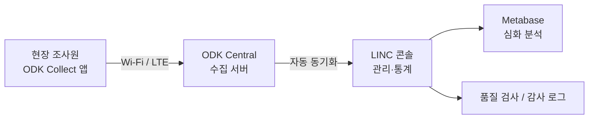
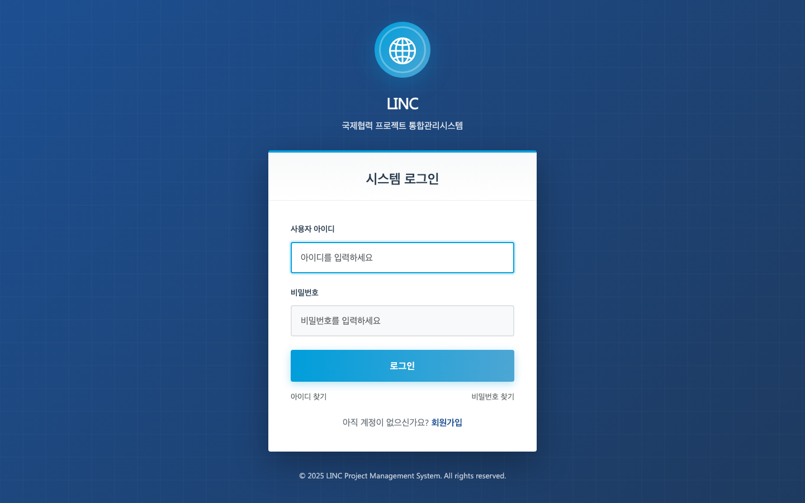
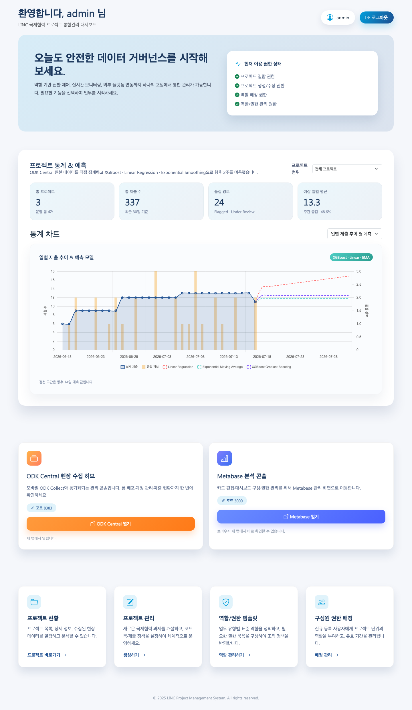
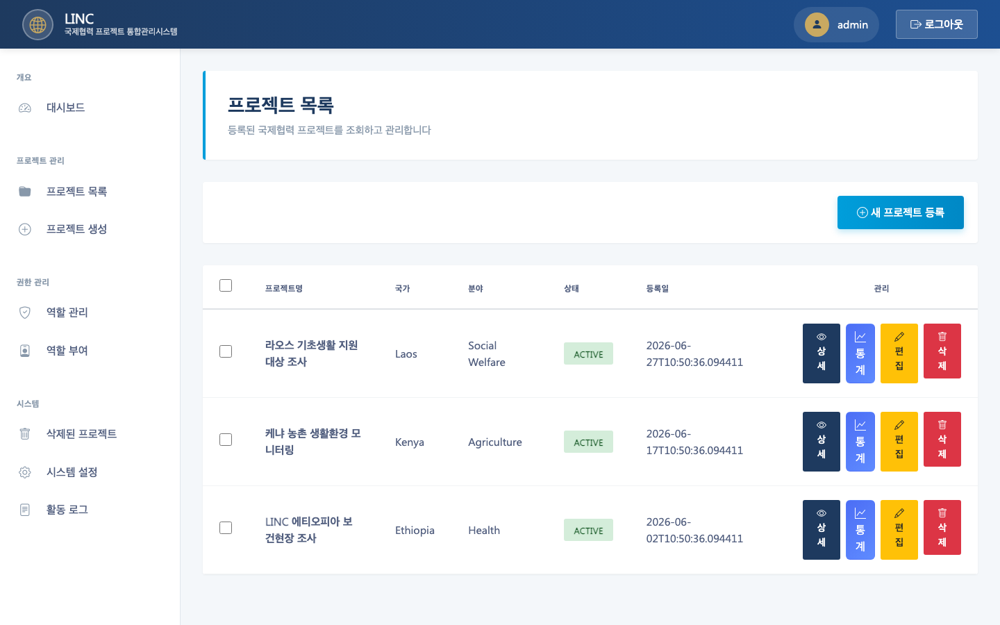
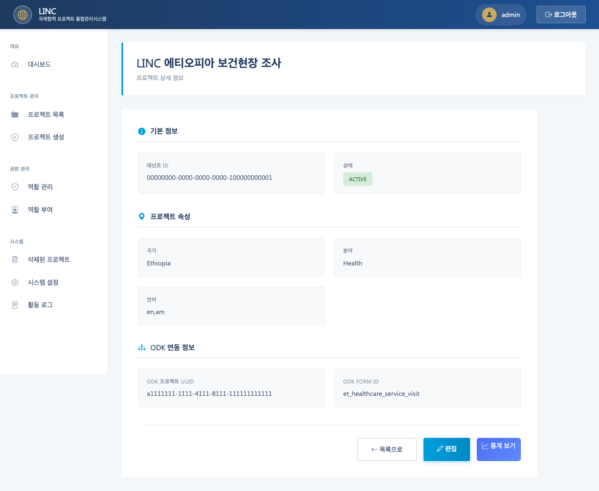
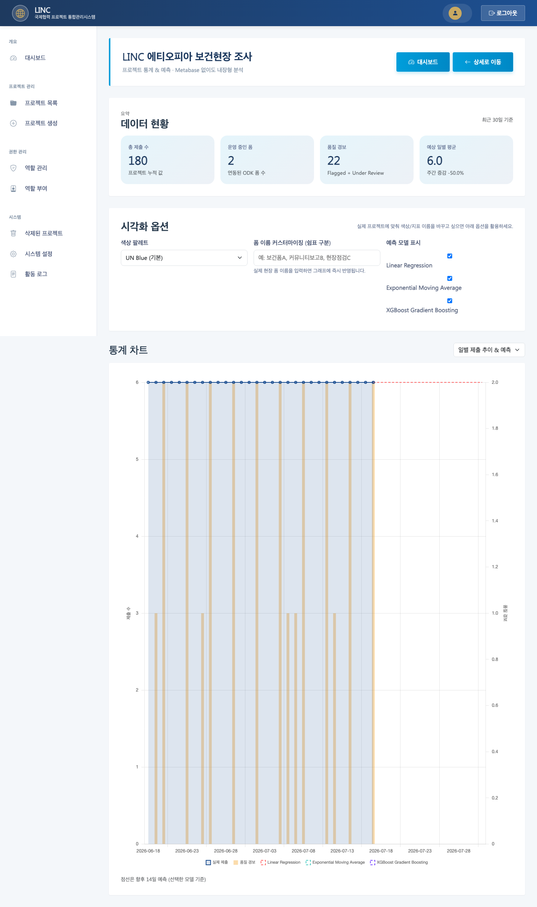
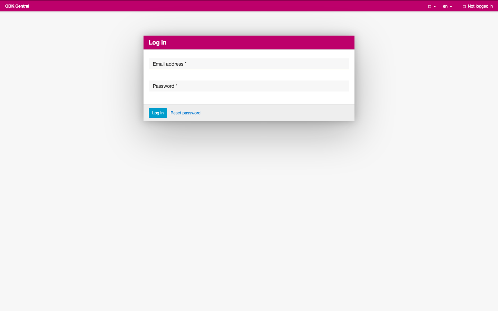
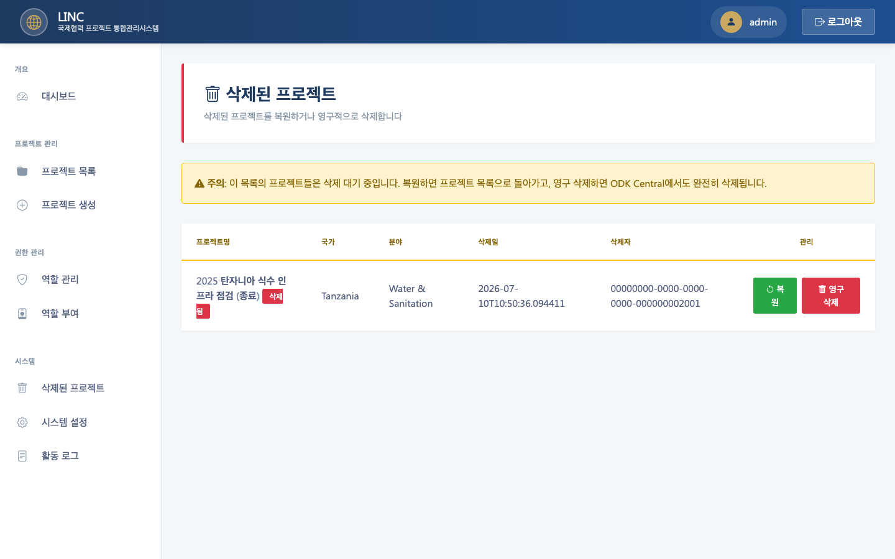

# LINC — 국제협력 프로젝트 데이터 통합관리시스템

> **현장에서 모바일로 수집한 데이터를, 하나의 화면에서 안전하게 관리·분석하는 플랫폼**

---

## 이 시스템은 무엇인가요?

**LINC**(Linked International Cooperation)는 해외 보건·복지·농업 등 **국제협력 현장조사**를 디지털로 운영하기 위한 **통합 관리 시스템**입니다.

현장 조사원이 스마트폰 앱(**ODK Collect**)으로 설문·점검표를 작성하면, 서버(**ODK Central**)로 전송되고, LINC 콘솔에서 **프로젝트·권한·품질·통계**를 한곳에서 확인할 수 있습니다.

개발 지식이 없어도 이해할 수 있도록, 아래에서는 **“누가 → 무엇을 → 왜”** 순서로 설명합니다.

---

## 왜 필요한가요? (해결하는 문제)

| 기존 방식의 어려움 | LINC가 제공하는 해결 |
|---|---|
| 종이 설문·엑셀 파일이 여기저기 흩어짐 | ODK 앱으로 **표준화된 디지털 수집** |
| 국가·프로젝트마다 형식이 달라 비교가 어려움 | **템플릿 기반**으로 동일한 구조 유지 |
| 누가 어떤 데이터를 볼 수 있는지 불분명 | **역할·권한(RBAC)** 으로 접근 통제 |
| 수집 후 분석까지 시간이 오래 걸림 | **대시보드·통계·예측**으로 빠른 의사결정 |
| 데이터 품질 문제를 나중에야 발견 | **품질 플래그·감사 로그**로 조기 점검 |

**한 줄 요약:**  
> “현장 조사 → 서버 동기화 → 관리자 확인 → 통계·의사결정”까지 **끊김 없이** 이어지는 **데이터 거버넌스 플랫폼**입니다.

---

## 누가 사용하나요?

| 역할 | 하는 일 | LINC에서 보는 화면 |
|---|---|---|
| **시스템 관리자** | 프로젝트 생성, ODK 연동, 권한 부여 | 프로젝트 관리, 역할/권한, 시스템 설정 |
| **4급·5급 담당자** | 담당 프로젝트 데이터 열람·분석 | 대시보드, 프로젝트 통계 |
| **현장 조사원** | ODK Collect 앱으로 현장 입력 | LINC가 아닌 **모바일 앱 + ODK Central** |
| **의사결정자** | 추이·품질·예측 확인 | 대시보드, 프로젝트 통계 |

---

## 전체 흐름 (비개발자용)

아래 다이어그램은 **데이터가 어떻게 흘러가는지**를 보여줍니다.



### Step 1. 프로젝트 설계 (관리자)

관리자가 LINC에서 **국가·분야·설문 템플릿**을 선택해 프로젝트를 만듭니다.  
시스템이 자동으로 ODK에 **동일한 설문 폼**을 배포합니다.

### Step 2. 현장 수집 (조사원)

조사원은 스마트폰 **ODK Collect** 앱으로 현장에서 설문·점검표를 작성합니다.  
인터넷이 되면 **ODK Central**로 자동 전송됩니다.

### Step 3. 자동 수집·동기화 (시스템)

LINC는 주기적으로 ODK Central에서 **새 제출 데이터**를 가져와 DB에 저장합니다.  
(데모 환경에서는 이 과정을 **미리 넣어 둔 샘플 데이터**로 재현했습니다.)

### Step 4. 확인·분석 (담당자)

담당자는 LINC **대시보드**와 **프로젝트 통계**에서  
제출 건수, 품질 이슈, 추세 예측 등을 확인합니다.

---

## 화면별 안내 (스크린샷)

### 1. 로그인 — 시스템 진입



- **목적:** 승인된 사용자만 시스템에 접근
- **데모 계정:** `admin` / `admin`
- **접속 주소:** http://localhost:8080

---

### 2. 통합 대시보드 — 한눈에 보는 현황



- **목적:** 전체 프로젝트의 **수집·품질·예측** 현황을 한 화면에서 파악
- **주요 정보**
  - 총 프로젝트 수, 최근 30일 제출 건수
  - 품질 검토 대상(플래그) 건수
  - 일별 제출 추이 + **AI 예측 모델** (XGBoost, 선형회귀 등)
- **연동 도구 바로가기**
  - **ODK Central** (현장 수집 허브) → `:8383`
  - **Metabase** (심화 분석) → `:3000`

> 💡 **포트폴리오 포인트:** “수집(Odk) + 관리(LINC) + 분석(Metabase)”를 **하나의 UX**로 묶은 통합 허브

---

### 3. 프로젝트 목록 — 운영 중인 사업 관리



- **목적:** 국가·분야별 **국제협력 프로젝트** 등록·조회
- **데모에 포함된 프로젝트**

| 프로젝트명 | 국가 | 분야 | ODK 폼 | 제출 수 |
|---|---|---|---|---|
| LINC 에티오피아 보건현장 조사 | Ethiopia | Health | `et_healthcare_service_visit` | 180건 |
| 케냐 농촌 생활환경 모니터링 | Kenya | Agriculture | `baseline_survey` | 95건 |
| 라오스 기초생활 지원 대상 조사 | Laos | Social Welfare | `baseline_survey` | 62건 |

각 행에서 **상세 / 통계 / 편집 / 삭제**를 바로 실행할 수 있습니다.

---

### 4. 프로젝트 상세 — ODK 연동 정보 확인



- **목적:** 프로젝트 메타정보 + **ODK 연동 상태** 확인
- **확인 가능한 항목**
  - 국가, 분야, 사용 언어
  - ODK Project UUID, ODK Form ID
  - 프로젝트 상태 (`ACTIVE`)

> 현장에서 수집된 데이터가 **어느 ODK 프로젝트·폼**에 속하는지 명확히 추적할 수 있습니다.

---

### 5. 프로젝트 통계 — 수집 데이터 분석



- **목적:** 특정 프로젝트의 **제출 추이·품질·예측** 분석
- **데모 예시 (에티오피아 보건현장 조사)**
  - 총 제출: **180건**
  - 운영 중인 폼: **2개** (방문조사 + 추적조사)
  - 품질 이슈: **22건** (검토/해결 포함)
- **차트:** 일별 제출 막대 + 품질 플래그 + 14일 예측선

> 💡 **포트폴리오 포인트:** Metabase 없이도 **내장 통계 화면**으로 즉시 인사이트 제공

---

### 6. ODK Central — 현장 수집 허브



- **목적:** 모바일 앱과 연결되는 **수집 서버** (설문 배포·제출 저장)
- **접속 주소:** http://localhost:8383
- LINC에서 프로젝트를 만들면, 여기에 **동일한 설문 폼**이 생성·배포됩니다.

---

### 7. 삭제된 프로젝트 — 종료 사업 보관



- **목적:** 종료된 프로젝트를 **완전 삭제하지 않고 보관**
- **데모 예시:** `2025 탄자니아 식수 인프라 점검 (종료)` — 복원 또는 영구 삭제 가능

---

## 데모 데이터는 어떤 가정을 담고 있나요?

영상·포트폴리오 촬영을 위해, **“ODK로 현장에서 데이터를 받았다”**는 시나리오를 DB에 미리 구성했습니다.

| 데이터 종류 | 내용 |
|---|---|
| **ODK 제출 337건** | 최근 30일에 걸쳐 분포 (에티오피아 180 + 케냐 95 + 라오스 62) |
| **ODK 메타데이터** | `deviceId`, `submitterId`, `submissionDate` 등 실제 Collect 형식 |
| **보건 현장 데이터** | 시설 ID, 환자 ID, 진단, 조사원 이름, 지역 등 |
| **설문 데이터** | 가구원 수, 성별, 연령대, 필요 서비스, 의견 등 |
| **품질 플래그 29건** | flagged / under_review / resolved 상태 |
| **동기화 커서** | ODK 증분 수집이 “방금 전” 완료된 것처럼 설정 |

### 데모 데이터 다시 넣기

```bash
docker exec -i egov-lowdata-suite-postgres-1 psql -U egov -d egov \
  < egov-lowdata-suite/scripts/sql/demo_seed_odk.sql
```

---

## 시스템 구성 (간단히)

| 구성요소 | 역할 | 비유 |
|---|---|---|
| **LINC 콘솔** | 프로젝트·권한·통계 관리 | “지휘 본부” |
| **ODK Central** | 모바일 제출 수신·보관 | “현장 데이터 창고” |
| **ODK Collect** | 스마트폰 설문 앱 | “조사원 도구” |
| **Metabase** | 고급 BI 대시보드 | “심화 분석실” |
| **PostgreSQL** | 모든 데이터 저장 | “기록 보관소” |

---

## 포트폴리오용 핵심 메시지

1. **End-to-End 설계** — 현장 수집(ODK)부터 관리·분석(LINC)까지 **전 과정**을 하나의 제품으로 설계
2. **데이터 거버넌스** — 역할 기반 권한, 품질 플래그, 감사 로그로 **안전한 데이터 운영**
3. **의사결정 지원** — 단순 집계를 넘어 **예측 모델**까지 내장한 대시보드
4. **국제협력 도메인** — 에티오피아 보건, 케냐 농업, 라오스 복지 등 **실제 ODA 시나리오** 반영
5. **운영 친화 UX** — 개발자가 아닌 **현장·행정 담당자**도 바로 사용 가능한 UI

---

## 기술 스택 (참고)

<details>
<summary>개발자용 — 기술 상세 보기</summary>

- **Backend:** Java, Spring, eGovFrame, MyBatis
- **Frontend:** JSP, Bootstrap 5
- **Data Collection:** ODK Central v2025.2.3, ODK Collect
- **Analytics:** Metabase, 내장 Chart.js 대시보드, XGBoost 예측
- **Database:** PostgreSQL
- **Infra:** Docker Compose (로컬), Colima (macOS)

실행 방법은 `egov-lowdata-suite/LOCAL_RUN.md` 참고.

</details>

---

## 관련 파일

| 파일 | 설명 |
|---|---|
| `egov-lowdata-suite/scripts/sql/demo_seed_odk.sql` | 데모 데이터 시드 SQL |
| `egov-lowdata-suite/docs/portfolio/capture_screenshots.py` | 스크린샷 자동 촬영 스크립트 |
| `egov-lowdata-suite/docs/portfolio/screenshots/` | 포트폴리오용 스크린샷 |
| `egov-lowdata-suite/LOCAL_RUN.md` | 로컬 실행 가이드 |

---

<p align="center">
  <sub>LINC Project — International Cooperation Data Governance Platform</sub><br>
  <sub>© 2025–2026 · Portfolio Demo Documentation</sub>
</p>
